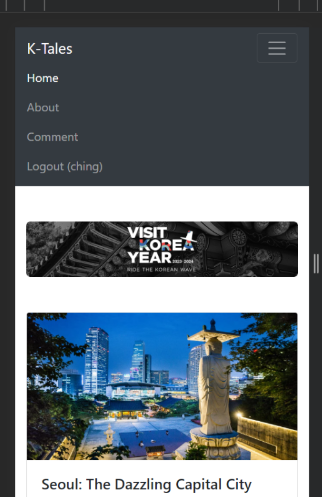

## K-Tales Travel Blog: Exploring Korea's Wonders

**Purpose:**
The K-Tales travel blog serves as a digital platform for discovering Korea's rich cultural heritage, picturesque landscapes, and vibrant destinations.

**Technological Stack:**
- Backend powered by PHP and MySQL for dynamic content management and user authentication.
- Frontend crafted with CSS styling strategies and Bootstrap frameworks for an intuitive user interface.
- Optimized for mobile devices to ensure a seamless experience on smartphones and tablets.

**Key Features:**
- Mobile Support: Fully responsive design for convenient browsing on any device.
- User & Feedback Management: Enables users to submit and manage feedback through a CRUD (Create, Read, Update, Delete) system.
- QR Code Integration: Innovative use of QR codes for easy access to the mobile version of the site.
Strengths:

- Engaging content showcasing Korea's enchanting landscapes and traditions.
- User-friendly interface with intuitive navigation and interaction.
- Robust backend infrastructure supporting dynamic interactions and content management.

## Output

